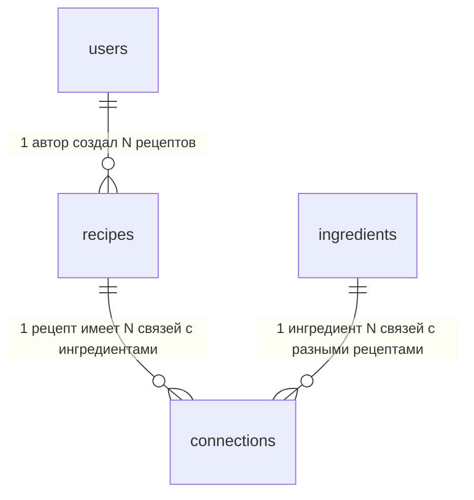

# dish-hub

## Установка и запуск

### 1. Клонирование репозитория
```bash
git clone https://github.com/bulbosaur/dish-hub
cd dish-hub
```

### 2. Установите зависимости
```bash
go mod download
```
### 3. Запустите приложение
``` bash
go run ./cmd/main.go
```

## Схема базы данных
